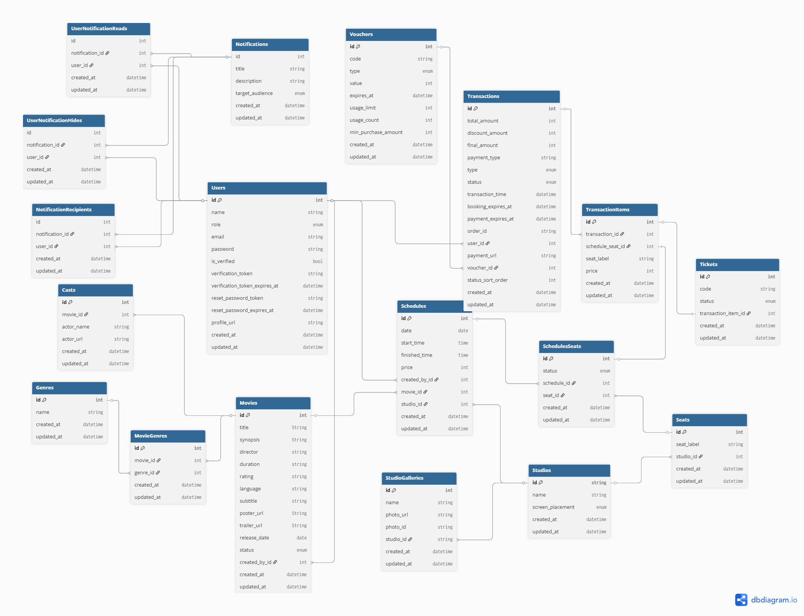

### Api Specifications

#### Auths
api/v1/
- **auths/login** POST | **(USER)**
```req.body = email,password```
- **auths/admin/login** POST | **(ADMIN)**
```req.body = email,password```
- **auths/refresh** POST | **(USER)**

#### Users
api/v1/

- **users** GET | **(ADMIN)**
- **users/:id** GET | **(ADMIN)**
- **users/** POST | **(ADMIN)**
 ```req.body = name,email,role,password,is_verified,profile_url```
- **users/:id** PATCH | **(ADMIN)**
 ```req.body = name,email,role,password,is_verified,profile_url```
- **users/:id** DELETE | **(ADMIN)**

- **users/register** POST | **(USER)**
 ```req.body = name,email,password passwordConfirmation```
- **users/verify** POST | **(USER)**
```req.body = email,verificationCode```
- **users/profile** GET | **(USER & ADMIN)**
- **users/profile/update** PATCH | **(USER & ADMIN)**
```req.body = name,email,profile_url```
- **users/change-password** PATCH | **(USER & ADMIN)**
```req.body = oldPassword,newPassword,newPasswordConfirmation```
- **users/forgot-password** POST | **(USER & ADMIN)**
```req.body = email```
- **users/reset-password** POST | **(USER & ADMIN)**
```req.body = passwordResetCode, newPassword, newPasswordConfirmation```
- **users/logout** POST | **(USER & ADMIN)**

#### Movies
api/v1/
- **movies/** POST | **(ADMIN)**
 ```req.body = title,synopsis,director,duration,rating,language,subtitle,poster_url,trailer_url,release_date,status,created_by```
- **movies/** GET | **(USER & ADMIN)**
 ```req.query = ?status=now_showing or coming_soon or ?page or ?limit```
- **movies/:id** GET | **(USER & ADMIN)**
- **movies/:id** PATCH | **(ADMIN)**
 ```req.body = title,synopsis,director,duration,rating,language,subtitle,poster_url,trailer_url,release_date,status,created_by```
- **movies/:id** DELETE | **(ADMIN)**

#### Casts
api/v1/
- **movies/:id/casts** POST | **(ADMIN)**
 ```req.body = actor_name,actor_url```
- **movies/:id/casts** GET | **(USER & ADMIN)**
- **casts/:id** PATCH | **(ADMIN)**
 ```req.body = actor_name,actor_url```
- **casts/:id** DELETE | **(ADMIN)**

#### Genres
api/v1/
- **genres/** POST | **(ADMIN)**
 ```req.body = name```
- **genres/** GET | **(USER & ADMIN)**
- **genres/:id** GET | **(USER & ADMIN)**
- **genres/:id** PATCH | **(ADMIN)**
 ```req.body = name```
- **genres/:id** DELETE | **(ADMIN)**

#### MoviesGenres
api/v1/
- **movies/:id/genres** POST | **(ADMIN)**
 ```req.body = movie_id,genre_id```
- **movies/:id/genres/:genresId** DELETE | **(ADMIN)**

#### Notifications
api/v1/
- **notifications/** POST | **(ADMIN)**
 ```req.body = title,description,is_read,user_id```
- **notifications/** GET | **(ADMIN)**
- **notifications/my** GET | **(USER & ADMIN)**
- **notifications/my/mark/:id** PATCH | **(USER & ADMIN)**
- **notifications/my/mark-all** PATCH | **(USER & ADMIN)**
 ```req.body = name```
- **notifications/:id** DELETE | **(USER & ADMIN)**


#### Studios
api/v1/
- **studios/** POST | **(ADMIN)**
 ```req.body = name```
- **studios/** GET | **(USER & ADMIN)**
- **studios/:id** GET | **(USER & ADMIN)**
- **studios/:id** PATCH | **(ADMIN)**
 ```req.body = name```
- **studios/:id** DELETE | **(ADMIN)**

#### StudioGalleries
api/v1/
- **studios/galleries/** POST | **(ADMIN)**
 ```req.body = name,photo_url,studio_id```
- **studios/galleries/** GET | **(USER & ADMIN)**
 ```req.query = ?studio_id=3```
- **studios/galleries/:id** PATCH | **(ADMIN)**
 ```req.body = name,photo_url,studio_id```
- **studios/galleries/:id** DELETE | **(ADMIN)**

#### Seats
api/v1/
- **seats/** POST | **(ADMIN)**
 ```req.body = seat_label,studio_id```
- **seats/** GET | **(ADMIN)**
- **seats/:id** PATCH | **(ADMIN)**
 ```req.body = seat_label,studio_id```
- **seats/:id** DELETE | **(ADMIN)**

#### Schedules
api/v1/
- **schedules/** POST | **(ADMIN)**
 ```req.body = date,start_time,finished_time,price,created_by,movie_id,studio_id```
- **schedules/** GET | **(USER * ADMIN)**
 ```req.query = ?movieId=3 or ?date```
- **schedules/:id** GET | **(USER * ADMIN)**
- **schedules/:id** PATCH | **(ADMIN)**
 ```req.body = date,start_time,finished_time,price,created_by,movie_id,studio_id```
- **schedules/:id** DELETE | **(ADMIN)**

#### SchedulesSeats
api/v1/
- **schedules-seats/** GET | **(USER * ADMIN)**
 ```req.query = ?scheduleId=3```
- **schedules-seats/:id** PATCH | **(ADMIN)**
 ```req.body = status,schedule_id,seat_id```
- **schedules-seats/:id** DELETE | **(ADMIN)**

#### Bookings & Transactions
api/v1/
- **transactions/** POST | **(USER)**
 ```req.body = schedule_id,seat_ids example [A2,A3],voucher_code```
- **transactions/:id/proceed** POST | **(USER)**
- **payments/callback** POST | **(MIDTRANS)**
- **transactions/my** GET | **(USER)**
- **transactions/** GET | **(ADMIN)**
- **transactions/:id** GET | **(USER & ADMIN)**
- **transactions/:id** DELETE | **(ADMIN)**

#### Tickets
api/v1/
- **tickets/** GET | **(ADMIN)**
- **tickets/my** GET | **(USER)**
- **tickets/:id** GET | **(USER & ADMIN)**
- **tickets/:id** DELETE | **(ADMIN)**

#### Vouchers
api/v1/
- **vouchers/** POST | **(ADMIN)**
 ```req.body = code,type,value,expires_at,usage_limit,usage_count,min_purchase_amount```
- **vouchers/** GET | **(ADMIN)**
- **vouchers/:id** GET | **(ADMIN)**
- **vouchers/:id** PATCH | **(ADMIN)**
 ```req.body = code,type,value,expires_at,usage_limit,usage_count,min_purchase_amount```
- **vouchers/:id** DELETE | **(ADMIN)**

#### Database Diagram
